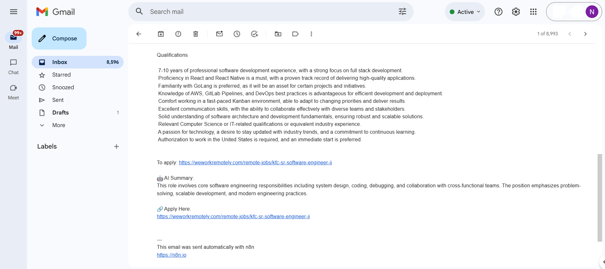

# 🚀 Automated Job Finder – Email Alerts (n8n)

An end-to-end automation workflow built with **n8n** that aggregates software engineering job postings from multiple sources, filters them intelligently, scores job quality, and delivers curated job alerts via email.

This project demonstrates **real-world automation design**, not toy examples.

---

## 🔍 What This Project Does

- Fetches job postings from multiple RSS job sources  
- Merges and normalizes incoming job data  
- Filters jobs based on:
  - Software / engineering roles  
  - Country or location criteria  
- Applies custom job quality scoring using JavaScript  
- Generates structured email alerts with relevant job links  
- Designed to scale easily by adding more RSS feeds  

---

## 🧠 Why This Project Matters

This workflow demonstrates:

- Practical automation design (not scripts)
- Data ingestion from multiple external sources
- Conditional logic and branching
- Custom business logic using JavaScript code nodes
- Clean separation of concerns
- Production-ready thinking using schedulers and filters

Built to show how **automation can replace repetitive manual job searching**.

---

## 🤖 AI Integration (Mocked)

The workflow includes an AI summarization step designed to integrate with Large Language Model (LLM) APIs such as OpenAI.

For demonstration purposes, a **mock AI node** is used to simulate job description summarization.  
This mock can be seamlessly replaced with a real LLM API call without changing the overall workflow structure.

---

## 🧩 Workflow Architecture

### High-Level Flow

Schedule Trigger
├─ RSS Feed 1
├─ RSS Feed 2
├─ RSS Feed 3
↓
Merge
↓
Filter: Software Jobs
↓
Filter: Country
↓
Job Scoring (Code)
↓
Quality Filter
↓
AI Job Summary (Mock)
↓
Email Content Builder
↓
Send Email

---

## 🖼 Workflow Diagram

---

## 🛠 Tech Stack

- **n8n** – workflow orchestration  
- **RSS** – job data ingestion  
- **JavaScript (Code nodes)** – filtering, scoring, AI mock logic  
- **Email node** – automated notifications  

---

## 📦 Repository Contents

.
├── workflowOverview.png # Workflow diagram (screenshot from n8n)
├── workflow.json # Exported n8n workflow
└── README.md # Project documentation

---

## ▶ How to Run This Workflow

1. Install or open **n8n**
2. Import the `workflow.json` file
3. Configure:
   - RSS feed URLs
   - Email credentials
4. Activate the workflow
5. Let the scheduler run automatically

---

---

## 🎯 Use Cases

- Automated job discovery
- Email alert systems
- Content aggregation pipelines
- Resume-ready automation projects

---

## 📌 Notes

- This project is intentionally kept **simple and extensible**
- New RSS feeds or filters can be added without redesign
- Built as a **portfolio-grade automation project**, not a demo

👤 Author

Nayil Ahmed Siddique
AI / Automation Engineer
(Project built to demonstrate real-world automation skills)
